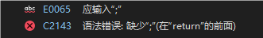

# 第二章 开始学习 C++

本章内容相对简单，需要掌握的内容为：

- 创建C++程序。
- C++程序的一般格式。
- `#include` 编译指令。
- `main()`函数。
- 使用`cout`对象进行输出。 
- 在C++程序中加入注释。
- 何时以及如何使用 `endl`。
- 声明和使用变量。
- 使用 `cin`对象进行输入。
- 定义和使用简单函数。

## 2.1 进入C++
首先介绍一个显示信息的简单C++程序，它使用`cout`工具进行输出。源代码中有一些帮助理解的注释，编译器编译程序时将自动去除它们。

!!! quote "换句话说，注释是供人类阅读的。"

```cpp
// myfirst.cpp -- 向控制台打印一些信息

#include <iostream> // 一条预处理命令       

int main() //函数头
//函数体开始
{                                
    using namespace std; // 使用命名空间std                      
        
    cout << "Come up and C++ me some time."<< endl;// 使用cout对象打印信息
    cout << "You won't regret it! " << endl;
    // endl对象的作用是新起一行，如果不加两句话就会粘在一起
    
    // 当然，这样也是可以的，与上述语句同义：
    // cout << "Come up and C++ me some time.";
    // cout << endl;
    // cout << "You won't regret it! ";
    // cout << endl;

    // 如果输出窗口在被看到之前就关掉了，可以添加下面的代码：
    cout << "Press any key to continue." << endl;
    cin.get();
    
    return 0; // 终止main()函数
}
// 函数体结束
```

运行编译后的程序得到的输出：
```
Comme up and C++ me some time.
You won't regret it! 
```

!!! info inline end "C语言输入和输出" 
    C++ 能够使用`printf()`、`scanf()`和其他所有标准 C 输入和输出函数，只需要包括常规 C 语言的`stdio.h`文件即可。但是 C++ 的 I/O 工具（输入输出工具）在 C 版本的基础上作了很多改进，所以在编写 C++ 程序时请尽可能使用 C++ 的 I/O 工具。

示例非常简单，只包括一个名为`main()`的函数。`myfirst.cpp`实例包含下述元素。

- 注释，由前缀`//`标识。
- 预处理器编译指令`#include`。
- 函数头：`int main()`。
- 编译指令 `using namespace`。
- 函数体，用{`里面是代码`}括起。
- 使用 C++ 的 `cout`工具打印信息的语句。
- 结束 `main()`函数的`return`语句。（可选）

下面详细介绍这些元素。先来看看`main()`函数，因为了解`main()`的作用后，`main()`前面的一些特征将更易于被我们理解。

### `main()`函数

去掉那些花里胡哨的东西后，`myfirst.cpp`的基本结构如下：

```cpp
int main()
{
    statements
    return 0;
}
```

function.png)

上面的代码表明有一个名为 `main()`的函数，并且描述了该函数的行为。这几行代码构成了 **函数定义（*function definition*）**。

函数定义由两部分构成：第一行`int main()`叫 **函数头（*function heading*）** 花括号`{}`中包括的部分叫 **函数体（*function body*）**。**函数头** 是指函数定义的开始部分，它包含了函数的返回类型、函数名以及函数的参数列表。**函数体** 是指出函数应做什么的计算机指令。

在 C++ 中，每条完整的指令都称为 **语句** 。所以的语句都以 **分号** 结束。
!!! tip "语句和分号"
    我们先来看两段代码。

    ```cpp
    #include <iostream>
    int main()
    {
        std
            ::cout <<
            "Hello World!"
            << std::
                endl
                    ; //第一句
        return
            0; //第二句
    }
    ```
    
    ```cpp
    #include <iostream>
    int main()
    {
        std::cout << "Hello World!" << std::endl; //第一句
        return 0; //第二句
    }
    ```
    
    事实上，这两段代码都能成功编译并在控制台上打印`Hello World!`。由此看来，编译器判断一条语句何时结束，另一条语句何时开始的依据是 **终止符（*terminator*）**，即`;` ，而不是代码缩进和行数。（恰好与Python相反。）

    结论是：**在 C++ 中，不能省略分号** 。
    
    

`main()`中最后一条语句叫做 **返回语句（*return statement*）** ,它结束该函数。
 


